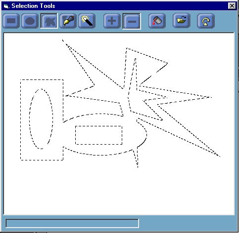

<div align="center">

## Complex Mask Selections v 1\.0


</div>

### Description

How to create and manage complex mask selections in a graphics app written in vb. You can select your mask with rectangle, ellipse, polygon, paint brush and wand tools and build it up progressively. Each tool can be used in either additive or subtractive mode...
 
### More Info
 


<span>             |<span>
---                |---
**Submitted On**   |2001-10-03 14:03:08
**By**             |[Meltdown Charlie](https://github.com/Planet-Source-Code/PSCIndex/blob/master/ByAuthor/meltdown-charlie.md)
**Level**          |Intermediate
**User Rating**    |5.0 (10 globes from 2 users)
**Compatibility**  |VB 4\.0 \(32\-bit\), VB 5\.0, VB 6\.0
**Category**       |[Graphics](https://github.com/Planet-Source-Code/PSCIndex/blob/master/ByCategory/graphics__1-46.md)
**World**          |[Visual Basic](https://github.com/Planet-Source-Code/PSCIndex/blob/master/ByWorld/visual-basic.md)
**Archive File**   |[Complex Ma274341032001\.zip](https://github.com/Planet-Source-Code/meltdown-charlie-complex-mask-selections-v-1-0__1-27755/archive/master.zip)

### API Declarations

```
Shows how to use many of the region api's including :
			- CombineRgn()
			- GetRegionData()
			- CreateRectRgn()
			- CreateEllipticRgn()
			- CreatePolygonRgn()
			- FillRgn()
			- ExtCreateRegion()
			- FrameRgn()
		Also shows how to use the brush apis to create two custom brushes for
		a marching ants effect.
			- CreateBrushIndirect()
			- CreatePatternBrush()
```


